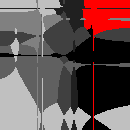

# Don't be so square... Voronoi

Our goal is to make NN algorithms with various distance function equivalent (in some sense)):
- Can two 1-NN algorithms with distance measures Lp and Lq, 0 < p,q < ∞, classify in the same way?
- How to learn an 1-NN, Lq-based classifier to work like an Lp-based one?

  
 