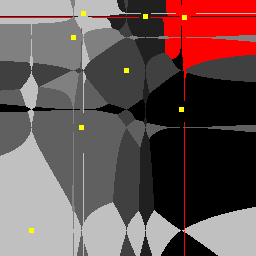

# [Ain't] be so square... Voronoi

Our goal is to make NN algorithms with various distance function equivalent (in some sense)):
- Can a pair of **1-NN** algorithms with distance functions *Lp* and *Lq*, 0 < *p,q* < ∞, classify in the same way?
- How to learn an **1-NN**, *Lq*-based classifier to behave like an *Lp*-based one?

Looks like the [Hanan grid](https://en.wikipedia.org/wiki/Hanan_grid) is the **(unique!)** answer!

Voronoi diagrams for *p = 1/4* and *p = 2*

  

and the *Lq*-agnostic Hanan-grid approximations for *p = 2*

 