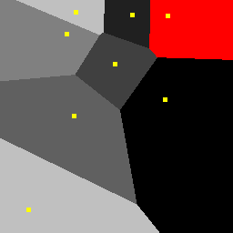
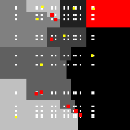

# 
[Ain't] be so **square**... Voronoi

Our goal is to make the NN algorithms with various distance functions equivalent (in some sense).
The following questions have already got their answer 
(because it looks like the **[Hanan grid](https://en.wikipedia.org/wiki/Hanan_grid)** provides a **(unique!)** answer to these questions!):
- Can two **1-NN** algorithms with distance functions $L_p$ and $L_q$, classify in the same way if $p\neq q$ for $0 < p,q < \infty$? 
- Can we learn an $Lq$-based **1-NN** classifier (with $q>0$ unknown and possibly varying) to behave predictably (*i.e.* exactly and like the $L_p$-based one, with a known $p>0$)?

Voronoi diagrams for the set $\mathcal{S}_N$ of $N = 8$ random patterns
|
:-:|:-: 
$p=\frac{1}{4}$|$p = 2$

$L_p$-agnostic Hanan-grid approximations $\mathcal{A}_N$ and $\mathcal{A}_{N+L}$ of the original set $\mathcal{S}_N$ with $p = 2$

|
|:---:|:---:|
|$N=8$|$N=8, L=8$|

# 
¡Hola «⅄⅃LY»!
