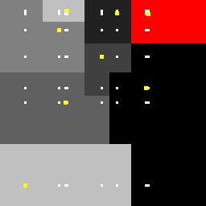

# [Ain't] be so square... Voronoi

Our goal is to make the NN algorithms with various distance functions equivalent (in some sense).
The following questions have already got their answer 
(because it looks like the **[Hanan grid](https://en.wikipedia.org/wiki/Hanan_grid)** provides a **(unique!)** answer to these questions!):
- Can a pair of **1-NN** algorithms with distance functions $L_p$ and $L_q$, can classify in the same way if $0 < p,q < ∞$ are different? [$\leftarrow$ YES!]
- Can we learn an $Lq$-based **1-NN** classifier (with $q>0$ unknown and possibly varying) to behave predictably and like the $L_p$-based one, with a known $p>0$? [$\leftarrow$ YES!]

See exemplary Voronoi diagrams for $p = \frac{1}{4}$ and $p = 2$ and the same set $\mathcal{S}_N, N = 8$, of random patterns:

  

and the $L_p$-agnostic Hanan-grid approximations for $p = 2$

 

# ¡Hola «⅄⅃LY»!